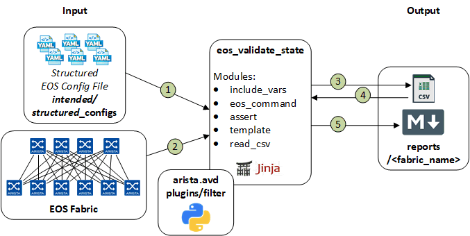

# Ansible Role: eos_validate_state

**Table of Contents:**

- [Ansible Role: eos_validate_state](#ansible-role-eos_validate_state)
  - [Overview](#overview)
  - [Role Inputs and Outputs](#role-inputs-and-outputs)
  - [Requirements](#requirements)
  - [Example Playbook](#example-playbook)
  - [Input example](#input-example)
    - [inventory/inventory.ini](#inventoryinventoryini)
    - [inventory/group_vars/DC1.yml](#inventorygroup_varsdc1yml)
    - [inventory/intended/structured_configs/switch1.yml](#inventoryintendedstructured_configsswitch1yml)
  - [Usage example](#usage-example)
  - [License](#license)

## Overview

**eos_validate_state** is role leveraged to validate operational states of Arista EOS devices.

**eos_validate_state** role:

- consumes structured EOS configuration file, the same input as the role [eos_cli_config_gen](ansible_collections/arista/avd/roles/eos_cli_config_gen). This input is considered the source of truth (the desired state).
- It connects to EOS devices to collects operational states (actual state). So this role requires an access to the configured devices.
- Compares the actual states against the desired state.
- Generates CSV and Markdown reports of the results.

## Role Inputs and Outputs

Figure 1 below provides a visualization of the roles inputs, and outputs and tasks in order executed by the role.



**Inputs:**

- Device structured configuration generated by abstration role.
- Device state with `eos_command` module.
- CSV report, leveraged to generate Markdown summary report.

**Outputs:**

- CSV report.
- Markdown summary report.

**Tasks:**

1. Include device structured configuration.
2. Collect and assert device state:

   - ([hardware](tasks/hardware.yml)) Validate environment (power supplies status).
   - ([hardware](tasks/hardware.yml)) Validate environment (fan status).
   - ([hardware](tasks/hardware.yml)) Validate environment (temperature).
   - ([hardware](tasks/hardware.yml)) Validate transceivers manufacturer.
   - ([ntp](tasks/ntp.yml)) Validate NTP status.
   - ([interface_state](tasks/interface_state.yml)) Validate Ethernet interfaces admin and operational status.
   - ([interface_state](tasks/interface_state.yml)) Validate Port-Channel interfaces admin and operational status.
   - ([interface_state](tasks/interface_state.yml)) Validate Vlan interfaces admin and operational status.
   - ([interface_state](tasks/interface_state.yml)) Validate Vxlan interfaces admin and operational status.
   - ([interface_state](tasks/interface_state.yml)) Validate Loopback interfaces admin and operational status.
   - ([lldp_topology](tasks/lldp_topology.yml)) Validate LLDP topology.
   - ([mlag](tasks/mlag.yml)) Validate MLAG status.
   - ([ip_reachability](tasks/ip_reachability.yml)) Validate IP reachability (on directly connected interfaces).
   - ([bgp_check](tasks/bgp_check.yml)) Validate ArBGP is configured and operating.
   - ([bgp_check](tasks/bgp_check.yml)) Validate ip bgp and bgp evpn sessions state.
   - ([reload_cause](tasks/reload_cause.yml)) Validate last reload cause. (Optional)

3. Create CSV report.
4. Read CSV file (leveraged to generate summary report).
5. Create Markdown Summary report.

## Requirements

Requirements are located here: [avd-requirements](../../README.md#Requirements)

## Example Playbook

```yaml
---
- name: validate states on EOS devices
  hosts: DC1
  connection: httpapi
  gather_facts: false
  collections:
    - arista.avd

  tasks:

    - name: validate states on EOS devices
      import_role:
         name: arista.avd.eos_validate_state
```

## Input example

### inventory/inventory.ini

```yaml
---
all:
  children:
    DC1:
      children:
        DC1_FABRIC:
          children:
            DC1_SPINES:
              hosts:
                switch2:
                  ansible_host: 10.83.28.190
            DC1_L3LEAFS:
              children:
                DC1_LEAF1:
                  hosts:
                    switch1:
                      ansible_host: 10.83.28.216
                DC1_LEAF2:
                  hosts:
                    switch3:
                      ansible_host: 10.83.28.191
```

### inventory/group_vars/DC1.yml

```yaml
ansible_user: 'arista'
ansible_password: 'arista'
ansible_network_os: eos
ansible_become: yes
ansible_become_method: enable

validation_mode_loose: true
```

### inventory/intended/structured_configs/switch1.yml

```yaml
router_bgp:
  neighbors:
    10.10.10.1:
      remote_as: 65002
    10.10.10.3:
      remote_as: 65003

ethernet_interfaces:
  Ethernet2:
    peer: switch3
    peer_interface: Ethernet4
    ip_address: 10.10.10.2/31
    type: routed
  Ethernet5:
    peer: switch2
    peer_interface: Ethernet5
    ip_address: 10.10.10.0/31
    type: routed

mlag_configuration:
  domain_id: MLAG12
  local_interface: Vlan4094
  peer_address: 172.16.12.1
  peer_link: Port-Channel10
  reload_delay_mlag: 300
  reload_delay_non_mlag: 330

ntp_server:
  local_interface:
    vrf: MGMT
    interface: Management1
  nodes:
    - 0.fr.pool.ntp.org
    - 1.fr.pool.ntp.org

dns_domain: lab.local
```

## Usage example

```shell
ansible-playbook playbooks/pb_validate_yml --inventory inventory/inventory.yml
```

## License

Project is published under [Apache 2.0 License](../../LICENSE)
